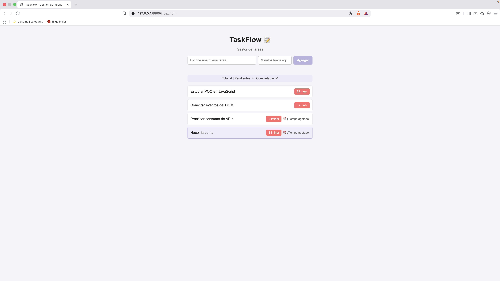
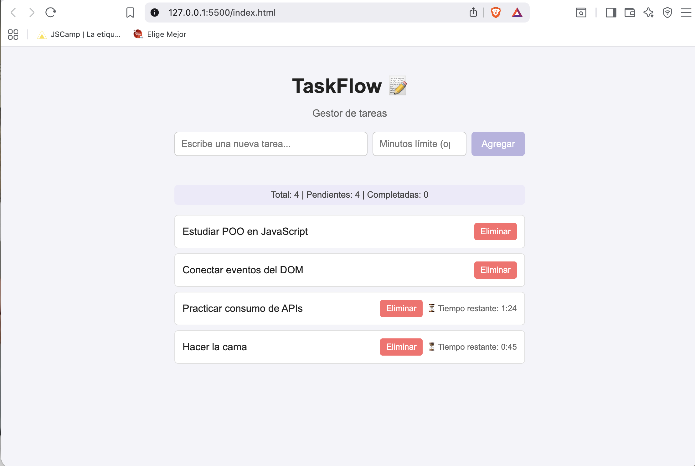
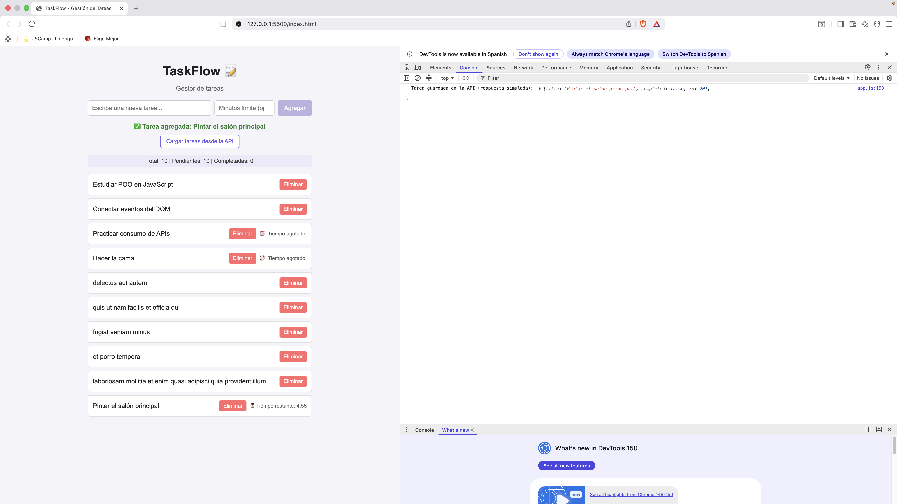
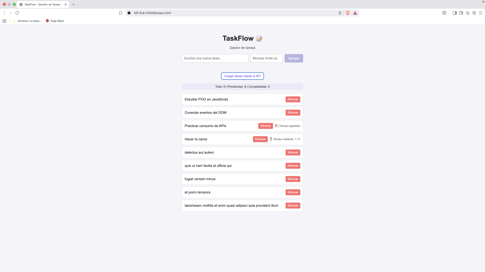

# TaskFlow 📝

Aplicación web de gestión de tareas desarrollada en **JavaScript moderno (ES6+)**, aplicando Programación Orientada a Objetos, manipulación del DOM, eventos, asincronía y consumo de APIs.

> Proyecto desarrollado como evaluación del **Módulo: Programación avanzada en JavaScript**, dentro del bootcamp Fullstack JavaScript (Talento Digital para Chile - SENCE).

## 📌 Descripción

TaskFlow permite crear, completar y eliminar tareas desde una interfaz web interactiva. Cada tarea puede tener una fecha límite opcional, mostrada como un contador regresivo en tiempo real. La aplicación guarda automáticamente las tareas en el navegador (`localStorage`), y permite traer tareas de ejemplo desde una API externa.

El proyecto fue construido de forma progresiva, en 5 pasos, cada uno aplicando un concepto distinto de JavaScript avanzado:

1. **Orientación a Objetos** — clases `Tarea` y `GestorTareas`.
2. **ES6+** — `let/const`, template literals, arrow functions, destructuring, spread/rest operators.
3. **Eventos y DOM** — formulario, eventos `submit`, `click`, `mouseover`/`mouseout`, `keyup`.
4. **Asincronía** — `setTimeout` (retardo simulado y notificaciones), `setInterval` (contador regresivo).
5. **Consumo de APIs** — `fetch()`, `localStorage`, manejo de errores con `try/catch`.

## ⚙️ Funcionalidades

- Crear tareas nuevas mediante un formulario, con validación de campo vacío.
- Marcar una tarea como completada/pendiente haciendo clic sobre su texto.
- Eliminar tareas individualmente.
- Asignar una fecha límite opcional (en minutos) a cualquier tarea, con contador regresivo en vivo.
- Resaltado visual al pasar el mouse sobre una tarea.
- El botón "Agregar" solo se habilita cuando hay texto escrito.
- Simulación de retardo al agregar una tarea (como si se guardara en un servidor).
- Notificación visual que aparece 2 segundos después de agregar una tarea.
- Persistencia de datos: las tareas no se pierden al recargar la página (`localStorage`).
- Botón para cargar tareas de ejemplo desde una API externa (JSONPlaceholder).
- Cada tarea nueva se intenta guardar también en la API, con manejo de errores.

## 🛠️ Tecnologías usadas

- **JavaScript (ES6+)** — módulos, clases, arrow functions, destructuring, spread/rest, async/await.
- **HTML5** — formulario semántico y estructura de la app.
- **CSS3** — estilos propios, sin frameworks.
- **Fetch API** — consumo de la API [JSONPlaceholder](https://jsonplaceholder.typicode.com/).
- **localStorage** — persistencia de datos en el navegador.

## 📁 Estructura del proyecto

```
taskflow-js/
├── index.html          # Estructura de la aplicación (formulario, lista, botones)
├── styles.css           # Estilos visuales
├── js/
│   ├── Tarea.js          # Clase Tarea (POO)
│   ├── GestorTareas.js   # Clase GestorTareas (POO + localStorage)
│   └── app.js            # Lógica principal: eventos, DOM, asincronía y API
├── README.md
└── /capturas             # Capturas de pantalla de la app en funcionamiento
```

## ▶️ Cómo ejecutar el proyecto

1. Clona o descarga este repositorio.
2. Abre la carpeta en Visual Studio Code.
3. Abre `index.html` con la extensión **Live Server** (clic derecho → "Open with Live Server").
   > Importante: este proyecto usa módulos ES6 (`import`/`export`), por lo que **no funciona** abriendo el archivo directamente con doble clic. Debe servirse a través de un servidor local como Live Server.
4. Abre las Herramientas de Desarrollador (`F12`) para ver mensajes de la consola relacionados con la API.
5. Escribe una tarea, opcionalmente indica minutos límite, y presiona "Agregar".

## 📖 Explicación del código (informe breve)

**Paso 1 — Orientación a Objetos:**
La clase `Tarea` representa una tarea individual (con `id`, `descripcion`, `estado` y `fechaCreacion`), incluyendo métodos para cambiar su estado. La clase `GestorTareas` administra la colección completa: agregar, eliminar, buscar y resumir tareas. Esta separación (una clase para el "dato" y otra para la "colección") es un patrón básico de POO.

**Paso 2 — ES6+:**
Se aplican `let`/`const` en todo el código, template literals para construir mensajes, arrow functions en callbacks de `forEach`/`filter`/`map`, destructuring para extraer propiedades de objetos (`const { total, pendientes, completadas } = ...`), y los operadores rest/spread para manejar múltiples tareas y devolver copias seguras de arreglos.

**Paso 3 — Eventos y DOM:**
El formulario captura el evento `submit` para agregar tareas sin recargar la página (`preventDefault()`). Cada tarea renderizada tiene sus propios eventos: `click` para completar/eliminar, y `mouseover`/`mouseout` para resaltar visualmente. El evento `keyup` en el campo de texto habilita/deshabilita el botón "Agregar" según si hay contenido escrito.

**Paso 4 — Asincronía:**
`setTimeout` simula el tiempo que tomaría guardar una tarea en un servidor real (1 segundo de espera), y también controla que la notificación de confirmación aparezca 2 segundos después. `setInterval` actualiza cada segundo el contador regresivo de las tareas con fecha límite, deteniéndose (`clearInterval`) cuando la tarea se vuelve a dibujar o el tiempo se agota.

**Paso 5 — Consumo de APIs:**
Se usa `fetch()` con `async`/`await` para traer tareas de ejemplo desde JSONPlaceholder (método GET) y para simular el guardado de una tarea nueva (método POST). Todo el manejo de la petición está envuelto en `try/catch`, de forma que si la API falla o no hay conexión, la aplicación muestra un mensaje de error en pantalla en vez de romperse. Además, `localStorage` guarda automáticamente el estado completo de las tareas cada vez que la lista cambia, y las recupera al volver a abrir la aplicación.

## 🎥 Demostración funcional

👉 [Ver video en Google Drive](https://drive.google.com/file/d/1FBy_Y58Ai07r9ztcDGN8D2-UJDkJ6zAg/view?usp=sharing)

## 📸 Capturas de pantalla

**Vista general de la aplicación:**


**Contador regresivo:**


**Notificación de tarea agregada:**


**Tareas cargadas desde la API:**


## 💡 Aprendizajes del proyecto

Este proyecto permitió aplicar de forma integrada los pilares de JavaScript moderno: estructurar datos con clases, conectar la lógica a una interfaz real mediante eventos y el DOM, manejar tiempos de espera y actualizaciones periódicas con asincronía, y finalmente comunicarse con servicios externos mediante `fetch()`, incorporando manejo de errores como parte natural del flujo (no como un añadido opcional).

## 👩‍💻 Autora

**Abigail Betsabé Arriagada Aravena**
Estudiante de Analista Programador Computacional (Duoc UC) | Bootcamp Fullstack JavaScript (Talento Digital para Chile)

- GitHub: [@arriagadaaravena](https://github.com/arriagadaaravena)